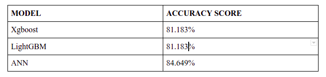

# Crime Rate Prediction with Machine Learning.

This repository contains code and other files for the crime rate prediction research project.

### File Descriptions

| File | Description |
| :- | :-: |
| data/ | Contains the train dataset |
| images/ | images used for illustration purposes in the README. |
| crime-pred.ipynb | Contains the code for the project |

### Code Execution & Environment
* The project code is executed using the Kaggle notebooks environment. In order to execute this code locally, change the `DATA_PATH` within the notebook here;
```
DATA_PATH = '../input/crime-dataset/communities-crime-clean.csv'
# Load data
def load_data(filename: str):
..
..
..
```
to a new data path where the dataset is stored and ensure all dependecies are installed. For instance, if you clone this repository, and want to run the notebook locally your new data path would be 
`./data/communities-crime-clean.csv`

### Manifest
crime-pred.ipynb:
<div>
  <ul>
    <li> Code for data loading and analysis </li>
    <li> Modeling </li>
    <li> Xgboost Model for crime rate prediction </li>
    <li> LightGBM Model for crime rate prediction </li>
    <li> ANN for crime rate prediction </li>
  </ul>
  </div>
  
<h3>Getting Started</h3><hr>
<b>Dependencies</b>
 <ul>
<li>Pandas</li>
<li>Numpy</li>
<li>sklearn</li>
<li>Matplotlib</li>
</ul>
<b>Language Used</b>
 <ul>
<li>Python : version above 3.0</li>
</ul>

### Models
* Three models are trained for this task and evaluated on the accuracy score metric. Results are presented as below;


### Acknowledgements
Credit goes to https://github.com/tina31726/Crime-Prediction/
From mentioned link, I have used the dataset.

Also, Credit goes to the reference research paper for this study -- Jos´e Ribeiro, Lair Meneses, Denis Costa, Wando Miranda, and Ronnie
Alves. Prediction of Homicides in Urban Centers: A Machine Learning Approach.


### Authors
Aakash Babubhai Gajera;
Feel free to contact me at gajeraa@lakeheadu.ca

### License
This project is not Licensed.

### Project Status
This project is completed and got accuracy above 80% for all models which I have used, however improvements can be made in terms of accuracy.

